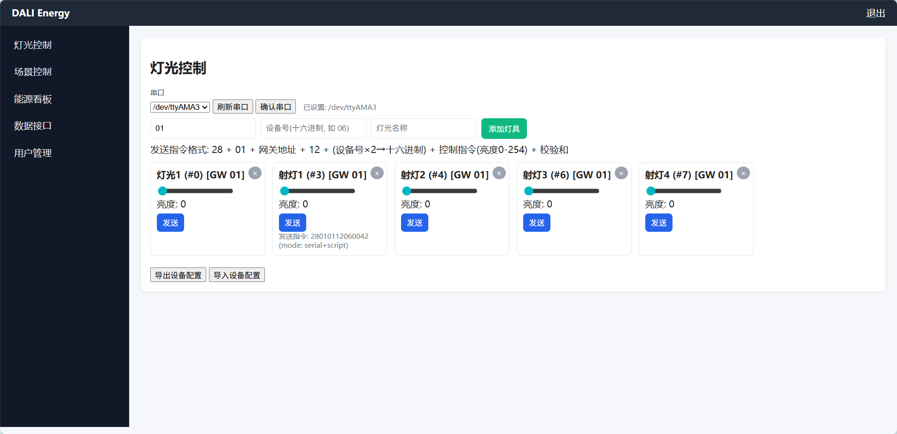
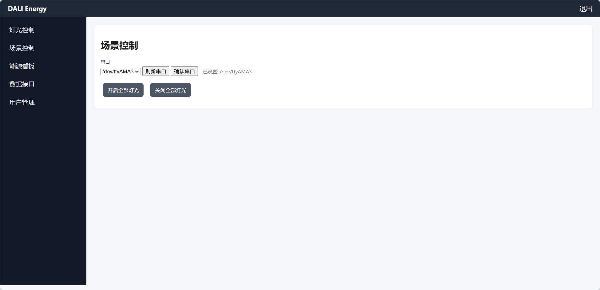
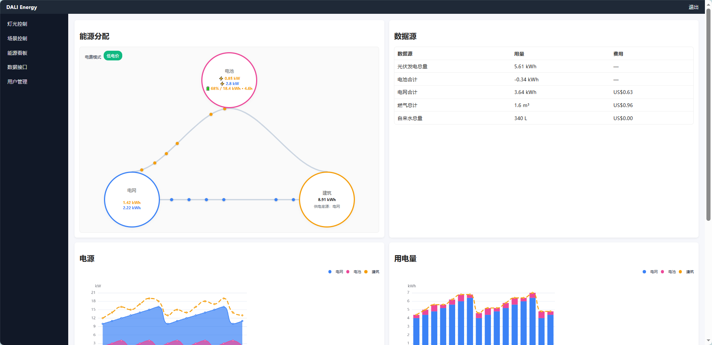
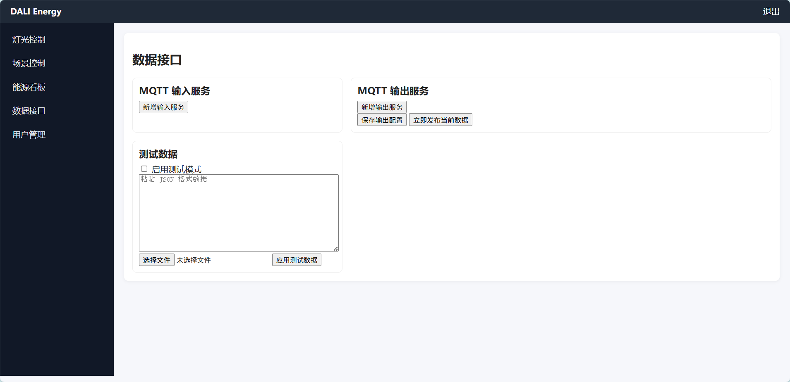

<div align="right">

<a href="./docs/README.en.md"></a>
<a href="./docs/README.zh.md"></a>

</div>

# DALI 灯光与能源管理应用

一个面向网关部署的 DALI 灯光与能源管理 Web 应用。集成串口灯光控制、场景控制、能源看板、MQTT 数据输入/输出与测试数据注入，适合本地网关与局域网使用，并支持二次开发扩展。

- 语言切换：English | 中文
  - English: ./docs/README.en.md
  - 中文: ./docs/README.zh.md

## 快速开始

- 运行环境
  - Python 3.9+（建议 3.11）
  - 依赖：`Flask`、`pyserial`、`paho-mqtt`（可选）
- 安装依赖
  - `pip install -r Project_DALI/requirements.txt`
- 启动服务
  - `python Project_DALI/app.py`
  - 打开浏览器访问 `http://localhost:5050/`
  - 登录账号与密码请在 `Project_DALI/config.py` 中配置

## Web 使用概览



- 灯光控制
  - 选择并确认串口：`/dev/ttyAMA2`、`/dev/ttyAMA3`、`/dev/ttyAMA4`
  - 添加灯具：名称、网关地址（十六进制，如 `01`）、设备号（十六进制，如 `06`）
  - 控制亮度并点击“发送”即通过后端串口下发十六进制指令
  - 导出/导入设备配置（`data/devices.json`）



- 场景控制
  - 同步提供串口确认功能
  - 一键开启全部灯光：`28010112fefe38`
  - 一键关闭全部灯光：`28010112fe003a`



- 能源看板
  - 实时功率曲线与用量统计（仅电网/电池/建筑）
  - 电价/电费历史：周期切换，单位切换（元/$/€），点击“刷新”拉取
  - 测试模式：粘贴/上传 JSON 后“应用测试数据”，立即显示



- 数据接口（MQTT）
  - 输入：可新增多个服务，每个服务可订阅多个主题并为“看板字段→JSON路径”建立映射（如 `realtime_price ← data.market.realtime_price`）
  - 输出：配置多个输出服务，一键“立即发布当前数据”到指定主题


## 十六进制指令说明（串口）

- 格式：`28 + 01 + 网关地址 + 12 + 设备地址 + 控制指令 + 校验和`
- 设备地址规则：设备号（十六进制输入）× 2 → 十六进制。例如设备号 `06` → 地址 `0C`
- 校验和：前六字节（不含校验位）逐字节累加取低字节
- 示例：设备号 `63`（十进制）→ `7E`（×2 后）
  - 指令：`280101127E00BA`

## 目录结构概览

```
DALI_Energy/
├── Project_DALI/
│   ├── app.py                # Flask 入口与路由
│   ├── config.py             # 站点配置（HOST/PORT/SECRET/账户等）
│   ├── templates/            # 页面模板（灯光/场景/能源/接口）
│   ├── static/
│   │   ├── js/               # 前端逻辑（lights/scenes/energy/interfaces）
│   │   └── css/              # 样式（响应式、图例、控件）
│   ├── data/                 # JSON 数据（devices/mqtt_inputs/mqtt_outputs）
│   └── scripts/              # 发送脚本（send_dali_hex.sh）
└── docs/
    ├── README.en.md          # 英文使用与开发文档
    └── README.zh.md          # 中文使用与开发文档
```

## 二次开发建议

- 前端
  - 统一在 `static/js/*.js` 进行交互逻辑开发；保持 UI 与数据结构一致性
  - 能源看板的数据结构：`{ summary, times, power_series, use_series }`
- 后端
  - 新增接口直接在 `app.py` 中按现有模式注册路由
  - 数据文件使用 `data/*.json` 管理，读写工具 `read_json/write_json`
  - 串口发送优先 `pyserial`，失败回退 `open(...,'wb')` 或 `bash scripts/send_dali_hex.sh`
- 安全与日志
  - 生产环境请替换默认密钥与账户
  - 串口权限建议通过 udev 规则或专用用户组管理

## 贡献与许可

- 欢迎提交 Issue 与 PR
- 使用时请保留版权与许可声明（MIT/Apache-2.0 等，按实际设置）

---

切换至详细文档：

- English Doc → [docs/README.en.md](./docs/README.en.md)
- 中文文档 → [docs/README.zh.md](./docs/README.zh.md)

基于 Python + Flask 的轻量级 Web 应用，用于演示 DALI 灯光控制与能源看板。项目使用本地 JSON 文件作为临时数据存储，提供登录认证、设备发现、灯光控制、场景应用与能源实时数据等基础功能。默认监听 `0.0.0.0:5050`。

## 功能特性
- 极简登录认证：硬编码 `admin / passwd`，基于 Session 管理
- 设备发现（Mock）：RS485 端口扫描与 DALI 设备寻址
- 灯光控制：设置设备亮度（0–254）并更新前端 UI
- 场景管理：全亮/节能等示例场景，一键应用到所有设备
- 能源看板：ECharts 图表每 2 秒轮询展示实时功率与当日耗电
- 数据存储：`devices.json`、`scenes.json`、`energy_log.json`

## 技术栈
- 后端：Python 3 + Flask
- 模板：Jinja2
- 前端：原生 HTML/CSS/JS + Fetch API，ECharts（CDN）
- 存储：JSON 文件（不使用数据库）

## 目录结构
```
Project_DALI/
├── app.py                 # Flask 入口与路由、API
├── config.py              # 全局配置（HOST/PORT/ADMIN/SECRET_KEY/DATA_DIR）
├── requirements.txt       # 依赖清单（Flask）
├── data/                  # 临时数据（JSON 文件）
│   ├── devices.json       # 灯具列表（id/address/name/level）
│   ├── scenes.json        # 场景列表（actions）
│   └── energy_log.json    # 能源历史记录
├── static/                # 静态资源
│   ├── css/style.css      # 基础样式
│   ├── js/auth.js         # 登录态/导航（占位）
│   ├── js/lights.js       # 灯光控制前端交互
│   ├── js/scenes.js       # 场景按钮交互
│   └── js/energy.js       # 能源图表轮询
└── templates/             # 页面模板
    ├── login.html         # 登录页
    ├── base.html          # 页面骨架（导航/资源加载）
    └── dashboard.html     # 仪表盘（灯光/场景/能源）
```

### 关键配置
- 配置文件：`config.py`
  - `HOST = '0.0.0.0'`
  - `PORT = 5050`
  - `ADMIN_USER = 'admin'`
  - `ADMIN_PASS = 'passwd'`
  - `SECRET_KEY = 'dali-energy-secret-key'`
  - `DATA_DIR = 'data'`

## API 约定
- 认证与导航
  - `GET /` 未登录重定向 `/login`；已登录渲染仪表盘
  - `GET /login` 渲染登录页
  - `POST /login` 表单字段 `username`/`password`；成功写入 Session 并跳转 `/`
  - `GET /logout` 清理 Session 并重定向 `/login`
- 系统与设备发现
  - `GET /api/system/scan_ports` → `["/dev/ttyAMA0", "/dev/ttyAMA1"]`
  - `POST /api/system/connect_port` 输入 `{"port":"/dev/ttyAMA0"}` → `{"status":"success","msg":"已连接到 RS485 接口"}`
  - `POST /api/dali/scan_devices` → 返回 3–5 个假设备并写入 `devices.json`
- 灯光控制
  - `GET /api/lights` → 设备列表（来自 `devices.json`）
  - `POST /api/lights/control` 输入 `{"address":0,"command":"set_level","value":50}` → `{"status":"ok","new_level":50}`
- 场景管理
  - `GET /api/scenes` → 场景列表（来自 `scenes.json`）
  - `POST /api/scenes/apply` 输入 `{"scene_id":1}` → `{"status":"ok"}` 并更新所有设备亮度
- 能源看板
  - `GET /api/energy/realtime` → `{ "current_power_watt": 120.5, "daily_kwh": 3.2 }`（或取 `energy_log.json` 最近记录）

## 部署与运行

### 1. 环境准备
- 安装 Python 3.9+（建议 64 位）
  - Windows：从 python.org 下载并安装，勾选 “Add Python to PATH”
  - macOS：使用 Homebrew `brew install python`
  - Linux：使用发行版包管理器安装，如 `sudo apt-get install python3 python3-venv`

### 2. 获取代码
将 `Project_DALI/` 放置到本地任意目录，进入该目录的上级路径。

### 3. 安装依赖
- 使用虚拟环境（推荐）：
  - Windows PowerShell
    ```powershell
    python -m venv venv
    .\venv\Scripts\Activate.ps1
    pip install -r Project_DALI\requirements.txt
    ```
  - macOS/Linux
    ```bash
    python3 -m venv venv
    source venv/bin/activate
    pip install -r Project_DALI/requirements.txt
    ```
- 直接安装（不建议，可能污染系统环境）：
  ```bash
  pip install Flask
  ```

### 4. 启动服务
在激活的虚拟环境中执行：
```bash
python Project_DALI/app.py
```
服务默认监听 `0.0.0.0:5050`。若需修改，请编辑 `Project_DALI/config.py` 的 `HOST/PORT`。

### 5. 访问应用
- 浏览器打开 `http://localhost:5050/`
- 使用账号 `admin`，密码 `passwd` 登录
- 仪表盘中可进行设备扫描、调光、应用场景与查看能源曲线

## 常见问题
- 命令 `python` 不可用（Windows）
  - 解决：确认安装 Python 并将其加入 PATH，或使用 `py -3` 启动
- 端口被占用
  - 解决：修改 `config.py` 的 `PORT`，或释放占用端口
- 静态资源未加载
  - 解决：确认访问路径为 `http://localhost:5050/`，且浏览器未被代理拦截

## 后续扩展
- 串口集成：引入 `pyserial` 读取真实 RS485 端口与 DALI 报文
- 能源计算：根据亮度估算功率并累计日耗电，记录到 `energy_log.json`
- 用户管理：替换硬编码，支持多用户与角色权限
- 日志与审计：记录操作日志、错误日志与接口访问统计

